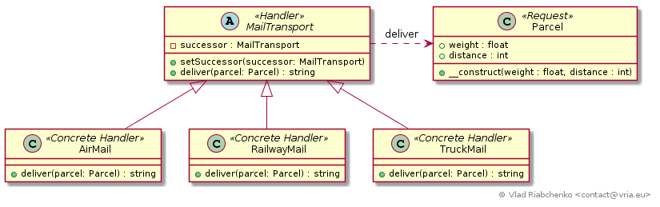

Chain of responsibility
=======================

This pattern allows multiple objects to handle a request by arranging these
handlers in a chain. Each handler (except the last one in a chain) holds a 
reference to another handler, its successor. Not being able to process a request
a handler passes it to its successor which can either pass to its successor 
likewise or finally handle it. In the last case the request propagation stops.

There is always an abstract `Handler` class/interface on which clients depend.
Any `ConcreteHandler` may be the first in a chain to start treating. When the 
last handler cannot treat a request it can do noting or return a default 
result or throw an exception. 

A request can be represented by a semantic method name or it can be a generic 
method `handle` with a semantic parameter. 

See [https://en.wikipedia.org/wiki/Chain-of-responsibility_pattern](https://en.wikipedia.org/wiki/Chain-of-responsibility_pattern) for more information.

## Implementation

Consider a post office that deliver parcels. Depending on parcel characteristics 
it can be delivered by:
- [TruckMail] a truck transports medium parcels on medium distances,
- [RailwayMail] a railway transports heavy parcels on long distances,
- [AirMail] an airmail transports light parcels on very long distances.

A parcel, represented by [Parcel] class, contains its weight and distance.
This is a `Request` in terms of Chain of Responsibility.

All transport methods ([TruckMail], [RailwayMail], [AirMail]) inherit from 
abstract [MailTransport] which:
- defines `$successor` property of type [MailTransport]. This is in order to 
  implement chaining of transport methods.
- defines the default implementation of `deliver(Parcel $parcel)` method. 
  The default logic is to pass the responsibility to the successor. Concrete 
  transports (air, railway, truck) will call this method in case if they are not 
  able to deliver a parcel. If there is no other transport to deliver a parcel 
  then an exception is thrown notifying a user that his parcel is out of 
  weight and/or distance.

[TruckMail]: TruckMail.php
[RailwayMail]: RailwayMail.php
[AirMail]: AirMail.php
[Parcel]: Parcel.php
[MailTransport]: MailTransport.php
