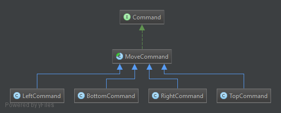

Command pattern
========================================

See [https://en.wikipedia.org/wiki/Command_pattern](https://en.wikipedia.org/wiki/Command_pattern) for more information.

Given that one object (`Invoker`) calls a method of another object (`Receiver`), 
it is possible to decouple `Invoker` and `Receiver` by means of `Command` object. 
The `Receiver`'s method that the `Invoker` wants to call (and the `Receiver` itself) is hidden behind `Command` object.

So instead of 
```
Invoker {
    function() {
        /** @var $receiver Receiver */
        $receiver->someMethod();
    }
}
```

you get

```
Invoker {
    function() {
        /** @var $command Command */
        $command->execute();
    }
}

CommandReceiver extends Command {
    function execute() {
        /** @var $receiver Receiver */
        $receiver->someMethod();
    }
}
```

Encapsulating a specific method call in a generic object `Command`, you get the opportunity to parametrize the `Invoker` 
with absolutely any commands that result to calling an any specific `Receiver` method. 
The command pattern also brings additional opportunities like conserving the historiy of executed commands or undoing commands.

The interesting fact is that commands are an object-oriented replacement for callbacks.

Example implementation simulates a game control schema: player aims to reach a goal by moving to left, right, top, bottom. 
The client issues requests that are represented by strings "left", "right", "top", "bottom". 
Each request is parametrized with a Command.

Participants:
- Command (`Command`): declares an interface for executing an operation `move` and undoing operation `moveBack`.
- ConcreteCommand (`BottomCommand`, `LeftCommand`, `RightCommand`, `TopCommand`): defines a binding between 
the `Receiver` (`Field`) and an action ("left", "right", "top", "bottom").
- Client (`GameApp`): creates and holds concrete commands (`GameApp::keyboard`), 
issues a requests ("left", "right", "top", "bottom"), usually holds receiver (Field)
- Invoker (`GameApp::keyboard`): asks the command to carry out the request
- Receiver (`Field`): knows how to perform the operations associated with carrying out a request. 
Any class may serve as a Receiver.



An example can be enhanced by macro commands.
