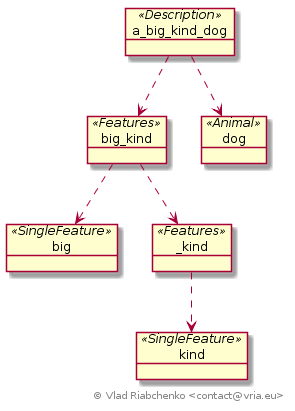
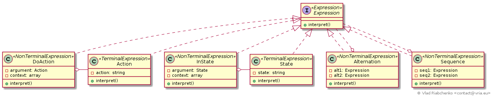

Interpreter
===========

Some recurring problems can be expressed as sentences in simple language which 
is usually called Domain Specific Language (DSL). Interpreter pattern allows 
you: 

1. To express the grammar rules of a DSL as classes,
2. To represent sentences in DSL as a tree of objects. Each object is an 
   instance of some class from p.1. This tree is usually called AST (Abstract 
   Syntax Tree).
3. To define methods to interpret sentences in DSL that is the methods to
   evaluate AST.

A DSL can be defined using [Backus–Naur form] (BNF). It is a notation technique 
for the exact description of languages syntax.

BNF is a finite set of rules (sometimes called "productions"). Each rule is 
written as:  

```
<symbol> ::= __expression__
```

`<symbol>` is an artificial name (variable) for a language construct. Tt is 
defined by `__expression__`. In other words, `<symbol>` is derived from 
`__expression__`; that is why BNF rules are called derivation rules. This means 
that `<symbol>` can be replaced by `__expression__`. 

`__expression__` can consist of:

- individual characters (`a`, `,`, `/`, etc.),
- individual words (`begin`, `or`, `end`, etc.),
- any string (`to be or not to be`),
- alternation (choice) of characters, words, strings : (`come | leave | stay`).
  The `|` character separates the alternatives. 
- include other symbols or even recursively include the symbol that is being 
  currently defined.

There are two kind of symbols: *terminal* and *non-terminal* ones. 

A symbol is called *terminal* if it's `__expression__` does not include another 
symbol. Terminal symbols are evaluated immediately:

```
<terminal symbol> ::= good dog
# corresponds exactly to the text "good dog" in a sentece
```

```
<terminal symbol with alternation> ::= one | two | three
# corresponds to one of these values: "one" or "two" or "three"
```

Non-terminal symbols are defined through other symbols that in turn can be both 
terminal ones and non-terminal ones:

```
<description> ::= a <features> <animal>
<features> ::= <single feature> | <single feature> <features>
<single feature> ::= red | kind | young
<animal> ::= dog | cat
# <description> corresponds to many velues: "a red dog", "a young red dog", 
# "a red young dog", "a kind kind king dog", etc. 
``` 

- `<description>` is a non-terminal symbol defined through another symbol 
  `<features>`.
- `<features>` symbol is defined through two symbols : `<single feature>`  
  and itself. It's a recursive definition.
- `<single feature>` is a terminal symbol with three alternative vales.
- `<animal>` is a simple terminal symbol with two alternative vales.

Interpreter pattern suggests crating a class for each derivation rule of BNF.
For the example above it would be `Description`, `Features`, `SingleFeature` and
`Animal`. 

It's clear that the `Description` class aggregates one instance of 
`Features` and one instance of `Animal`. `Features` class in turn aggregates an
instance of `SingleFeature` and optionally an instance of `Features` 
recursively. `Description` and `Features` are non-terminals. The classes 
`SingleFeature` and `Animal` do not aggregate other objects, that is why they 
are terminals.
 
While the classes represent grammar rules of a DSL, the objects of these classes 
represent sentences of the DSL. More precisely a three of objects represent a 
sentence. This kind of tree is usually called [Abstract Syntax Tree] (AST). E.g.
the sentence "a big kind dog" is represented by this AST:



AST clearly depicts the difference between terminal and non-terminal symbols:
terminal symbols are always the leafs of AST while non-terminal symbols always
have children.

The process of constructing AST from the sentence in DSL is called *parsing*. It 
worth nothing that parsing is out of the scope of the Interpreter pattern. But 
the pattern defines a method to evaluate an AST that was constructed beforehand.
It is literally some public method defined in the classes representing grammar 
rules and available in every object of AST. 

See [https://en.wikipedia.org/wiki/Interpreter_pattern] for more information.

## Implementation



Imagine you want to provide the users of your library/API/application with a 
possibility to write sentences in some basic language. These sentences are 
assertions or predicates that are evaluated and produce a result. Let us say 
that these sentences act as security expressions to permit or reject client's
requests to some resources. Every request contains one of these actions: "view", 
"change", "delete". Every resource is in one of these states: "processing", 
"treated", "rejected".

For example, this expression results to "true" or "false" depending on the 
current request's action:

```text
doAction('view')
```

This depends on the current state of a resource:
 
```text
inState('treated') OR inState('rejected')
```

A change request to a resource in the processing state:
 
```text
doAction('change') AND inState('processing')
```

A delete request to a resource in the processing or in the treated state:
```text
doAction('delete') AND (inState('processing') OR inState('treated'))
```

The BNF of this DQL is: 

```text
 <expression> ::= <doAction> | <inState> | <alternation> | <sequence> | (<expression>)
<alternation> ::= <expression> OR <expression>
   <sequence> ::= <expression> AND <expression>
   <doAction> ::= doAction(<permission>)
    <inState> ::= inState(<state>)
     <action> ::= view | change | delete
      <state> ::= processing | treated | rejected
```

The corresponding classes are:

- [Expression] - A common interface for all grammar rules. Also it is a common 
  interface for all nodes in AST.
- [Alternation] - The expression that evaluates boolean `OR` operator.
- [Sequence] - The expression that evaluates boolean `AND` operator.
- [DoAction] - Evaluates the `doAction` function. It retrieves the current 
  request action from the `$context` and compares it to its argument in a 
  sentence.
- [InState] - Evaluates the `inState` function. It retrieves the current
  request action from the `$context` and compares it to its argument in a 
  sentence.
- [Action] - an action (`view`, `change`, `delete`) in a sentence.
- [State] - a state (`processing`, `treated`, `rejected`) in a sentence.

AST for the sentence `doAction('change') AND (inState('processing') OR 
inState('treated'))` is constructed as follows:

```php
$expr = new Sequence(
    new DoAction(new Action('change'), $context),
    new Alternation(
        new InState(new State('processing'), $context),
        new InState(new State('treated'), $context)
    )
);
```


`DoAction` and `InState` require a `$context` that holds current request's 
action and current resource state: 

```php
$context = [
    'current_action' => 'delete',
    'current_state' => 'processing',
];
```

Other dependencies (parameters, services, couple of variables) could replace 
`$context` if appropriate.

AST is evaluated recursively. Terminal nodes are evaluated immediately while 
non-terminal nodes are evaluated using on the values of theirs children.
But sometimes a node needs to know the evaluated value of its sibling node or 
subtree. In that case Interpreter pattern suggests storing already evaluated
values in the evaluation context in the form of array or hash or object. In 
this way a node can obtain a evaluated value of its sibling node. 

[Backus–Naur form]: https://en.wikipedia.org/wiki/Backus%E2%80%93Naur_form
[Abstract Syntax Tree]: https://en.wikipedia.org/wiki/Abstract_syntax_tree
[Expression]: Expression.php
[Alternation]: Alternation.php
[Sequence]: Sequence.php
[DoAction]: DoAction.php
[InState]: InState.php
[Action]: Action.php
[State]: State.php
