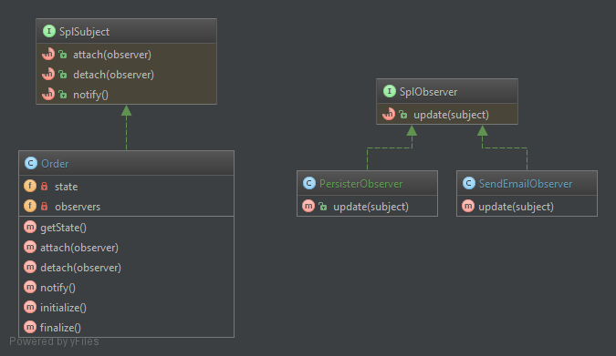

Observer
========================================

Observer pattern defines the interaction between a ***Subject*** and its ***Observers***
in a way that the ***Subject*** keeps the list of ***Observers*** and notifies them when
the event that they listen to happens.

The ***Subject*** doesn’t depend on concrete ***Observers*** classes but on the generic
interface (***Observer*** or ***Listener*** or ***\SplObserver***) that have the only method,
usually called ***notify*** or ***update*** or ***onEventName***.

See [https://en.wikipedia.org/wiki/Observer_pattern] for more information.

This implementation has the [Order] class as a ***Subject*** that evolves over the time:
from **INITIALIZED** to **FINALIZED**.

Whenever *Order* changes its state it notifies all attached *Observers*. Note that *Order*
knows nothing about its *Observers* but the fact that they implement *\SplObserver* interface.
This ensures better reusability of both the *Order* class and *Observers*.

There are three *Observers*:
* ***[PersisterObserver]*** is a listener that reacts to any change of *Order* and
"persists" it to database.
* ***[SendEmailObserver]*** is a listener that reacts to any change of Order object. When
*Order* is finalized it "sends" an email.
* ***[LoggerObserver]*** is a listener that reacts to any state change of *Order* object and logs
its new state.

*Observers* can be and usually are wired to other services to achieve their goal: persister
can be wired to *Doctrine*, emailer can be wired to *SwiftMailer*, logger can be wired to
*Monolog*.

In this implementation all listeners is notified any time the state is changed even though
*SendEmailObserver* needs to be called only on *Order*'s finalization state. One
variation of Observer pattern assumes that *Listeners* are subscribed to receive notifications
about particular event.

[https://en.wikipedia.org/wiki/Observer_pattern]: (https://en.wikipedia.org/wiki/Observer_pattern)
[Order]: Order.php
[PersisterObserver]: PersisterObserver.php
[SendEmailObserver]: SendEmailObserver.php
[LoggerObserver]: SendEmailObserver.php
