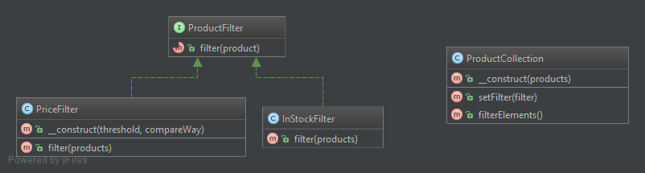

Strategy pattern (Policy)
=========================

The Stategy pattern is used to represent a family of algorithms encapsulating each of them into a separate class.
These classes are concrete implementations of single Strategy interface.
The class from with the code was extracted into concrete implementation of `Strategy` is called `Context`.

Strategy pattern is characterized by the following properties:

- `Context` is coupled only with the interface `Stategy` that permits to vary and add any concrete algorithm independently.
- Strategies configure a `Context` class with one of various behaviors.
- Strategy can be specified or changed at runtime.
- Strategy is an alternative of subclassing. Imagine that multiple classes vary only in their internal algorithm. 
Instead of creating a class hierarchy of these classes, you can extract different versions of this algorithm 
into separate classes (concrete strategies) and modify them as you please.
- Strategy is an alternative of multiple conditional statements. Consider this code that is often hard to understand and alter:

```
class Context 
{
    function do() 
    {
        if ($a) {
            // many lines of code A
        } elseif ($b) {
            // many lines of code B
        } else {
           // many lines of code Default
        }
    }
}
```

After encapsulating the varying code in commands :

```
interface DoStrategyInterface 
{
    public function do();
}

class DoStrategyA implements DoStrategyInterface
{
    public function do() 
    {
        // many lines of code A
    };
}

class DoStrategyB implements DoStrategyInterface
{
    public function do() 
    {
        // many lines of code B
    };
}

class DoStrategyDefault implements DoStrategyInterface
{
    public function do() 
    {
        // many lines of code Default
    };
}

class Context 
{
    /**
     * @var DoStrategyInterface
     */ 
    private $doStrategy;
    
    public function do() 
    {
        $this->doStrategy->do(); // One line
    }
}
```

Nevertheless Command pattern has the following drawbacks :

- Lots of concrete command classes - each for its own algorithm.
- The client's code gets complex because it must configure `Context` with proper `Strategy`:

```
if ($a) {
    $strategy = new DoStrategyA;
} elseif ($b) {
    $strategy = new DoStrategyB;
} else {
   $strategy = new DoStrategyDefault;
}

$context = new Context($strategy);
```

- Data flow overhead can happen when `Strategy::do` method needs a lot of parameters and/or returns a lot of data.
It may happen that some of strategies don't even need a part or all of the data passed to it anyway. 
On the other hand, the `Context` does not need to hold and prepare the data that is needed only by the strategy's algorithm,
this data can be already stored in concrete strategy class. 
So the `Context` gets simplified while each specific strategy holds only the required data. 

Note that the state should be maintained  by  the `Context` while strategies should not maintain any state across invocations.

See [https://en.wikipedia.org/wiki/Strategy_pattern](https://en.wikipedia.org/wiki/Strategy_pattern) for more information.

## Implementation

As an example of implementation consider following classes:  



- [ProductCollection] (`Context`) holds an array of products. A filtered list of products can be obtained from the method 
`ProductCollection::filterElements`. While different filtering algorithms can be applied to the original array of products, 
the current filter is held in `ProductCollection::$filter` property. If the filtering algorithm is not set 
then all products are returned. 
- [ProductFilterInterface] (`Strategy`) is a common interface for filters. 
- [InStockFilter] (`ConcreteStrategyA`) filters products by the criteria of being in stock.
- [PriceFilter] (`ConcreteStrategyB`) filters products by their price. Note that this filter requires additional 
parameters `PriceFilter::$threshold` and `PriceFilter::$compareWay`.

Check out [StrategyTest] the see the proper use of these classes.

[ProductCollection]: ProductCollection.php
[ProductFilterInterface]: ProductFilterInterface.php
[InStockFilter]: InStockFilter.php
[PriceFilter]: PriceFilter.php
[StrategyTest] : Test/StrategyTest.php
