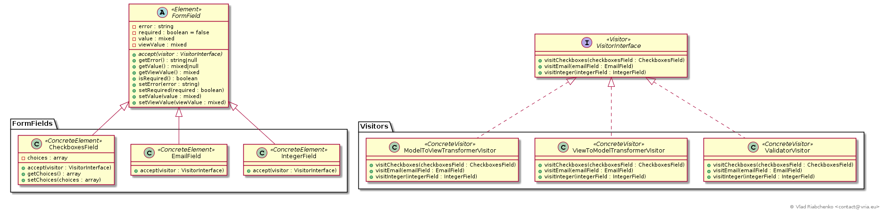

Visitor
=======

Visitor pattern lets you introduce a new method for a multiple classes without 
changing those classes. These new methods (one for each element class) 
are encapsulated in the `Visitor` class. When it comes to executing this 
operation the visitor object is passed to a generic method 
`acceptVisitor($anyVisitor)` of an element object which in turn calls a proper 
method of passed visitor.

So before: 

```
interface Element {
    public fucntion print();
    public fucntion sum();
    public fucntion do();
    // other methods
}

class First implements Element {
    public fucntion print() { // ... };
    public fucntion sum() { // ... };
    public fucntion do() { // ... };
    // other methods
}

class Second implements Element {
    public fucntion print() [ // ... };
    public fucntion sum() { // ... };
    public fucntion do() { // ... };
    // other methods
}
```

As you can see, in order to add a new operation in the `Element` interface, 
you need to add its body to each class that implements it. Hence you can end up 
with many large methods in your `First` and `Second` classes. 

Moreover a new operation can be quite different from the methods that already 
exist in `First` and `Second`. The classes get polluted very quickly with 
unrelated logic which breaks single responsibility principle.

Let's see how visitors can enhance the architecture:
```
interface Element {
    // This could be any visitor performing any operation.
    public fucntion accept(Visitor $visitor);
}

class First implements Element {
    public fucntion accept(Visitor $visitor) {
        // Call the method intended for the First class.
        $visitor->visitFirst($this);
    };
}

class Second implements Element {
    public fucntion accept(Visitor $visitor) {
        // Call the method intended for the Second class.
        $visitor->visitSecond($this);
    };
}

interface Visitor {
    public function visitFirst(First $first);
    public function visitSecond(Second $second);
}

// Gather all pringing logic
class PrintVisitor implements Visitor {
    public function visitFirst(First $first) { // printing first, may contain many lines };
    public function visitSecond(Second $second) { // printing second, may contain many lines };
}

// Gather all sum logic
class SumVisitor implements Visitor {
    public function visitFirst(First $first) { // sum first, may contain many lines };
    public function visitSecond(Second $second) { // sum second, may contain many lines };
}

// Gather all doing logic
class DoVisitor implements Visitor {
    public function visitFirst(First $first) { // doing first, may contain many lines };
    public function visitSecond(Second $second) { // doing second, may contain many lines };
}

// other visitors
```
 
As you cas see Visitor pattern shifted methods from `Element` interface (`print`,
`sum`, `do`) to the dedicated classes (`PrintVisitor`, `SumVisitor`, `DoVisitor`).
From now the methods are grouped by its purpose: printing, sum, doing, etc. To 
introduce a new operation to the `Element` and its implementators, you simply 
need to add a new visitor class without changing anything else.

This architecture gets much cleaner because it promotes a separation of concerns. 
Nevertheless it may affect encapsulation of `First` and `Second` classes 
because visitor's methods may require a lot of privilege.

See [https://en.wikipedia.org/wiki/Visitor_pattern](https://en.wikipedia.org/wiki/Visitor_pattern) for more information.



Consider a library for handling web form and its fields (like the Form component 
of Symfony).
Each field in a form corresponds to one of these classes: 
- [EmailField] for email text fields,
- [IntegerField] for integer fields,
- [CheckboxesField] for a group of checkboxes.

These classes inherit from [FormField] class that contains common properties:
- `$value`: submitted or default "php" value (also called "model value"),
- `$viewValue`: submitted or default "html" value,
- `$required`: if true then a field is required,
- `$error`: validation error message.

We can specify a default value to show in a field when its rendered by setting
`$value` property of the field. It then gets transformed to `$viewValue` and
shown. When a form is submitted all fields contain submitted data in theirs 
`$viewValue` properties. Then `$viewValue` is transformed to `$value`.
 
The view value must be validated before it gets transformed to php value: 
- email must be a valid email address, 
- integer can not contain nothing but digits,
- required field must not be empty,
- checkbox value must be allowed,
- etc.

We could add methods like `validate`, `transformModelToView`, 
`transformViewToModel` to [FormField] and redefine them is all its subclasses.
Another solution that the Visitor pattern suggests is to encapsulate these logic 
in separate classes called visitors:

- [VisitorInterface] a contract for all visitors, determines which form fields 
the visitors will be able to process (`visitEmail(EmailField $emailField)`, 
`visitInteger(IntegerField $integerField)`, 
`visitCheckboxes(CheckboxesField $checkboxesField)`),
- [ValidatorVisitor] validates form fields. It sets the message in the `$error` 
properties of the form fields if theirs view values are not valid, 
- [ModelToViewTransformerVisitor] sets `$viewValue` of the form field by 
transforming `$value`,
- [ViewToModelTransformerVisitor] sets `$value` of the form field by 
transforming `$viewValue`.

As for the form fields classes the only addition is the
`accept(VisitorInterface $visitor)` method that accepts any visitor.
This method is very similar in all form fields - the visitor is requested to 
perform its logic.     

Visitor pattern implements so-called "double dispatch" when the actual called 
method depends on both the class of the form element end the class of the 
visitor:

```
/**
 * This results in that any method of any visitor can be called.
 *
 * @var $field FormField
 * @var $visitor VisitorInterface
 */
$field->accept($visitor);
```

[FormField]: FormField.php
[EmailField]: FormFields/EmailField.php
[IntegerField]: FormFields/IntegerField.php
[CheckboxesField]: FormFields/CheckboxesField.php

[VisitorInterface]: VisitorInterface.php
[ValidatorVisitor]: Visitors/ValidatorVisitor.php
[ModelToViewTransformerVisitor]: Visitors/ModelToViewTransformerVisitor.php
[ViewToModelTransformerVisitor]: Visitors/ViewToModelTransformerVisitor.php
