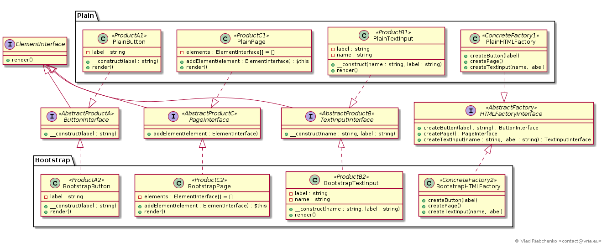

Abstract factory (Kit)
======================

The abstract factory pattern is about to delegate the creation of objects to a special object called `Factory`.
A client code that asks the factory to create objects on his behalf is coupled only with a generic interface that 
a concrete factory implements. Therefore various concrete factories are interchangeable.

Moreover the concrete classes of created objects are hidden from client behind their interfaces. 
So these classes are also interchangeable. 
Usually the objects created by concrete factory belong to the same family.

See [https://en.wikipedia.org/wiki/Abstract_factory_pattern](https://en.wikipedia.org/wiki/Abstract_factory_pattern) for more information.

## Implementation

Imagine that some html renderer or any other client code needs to create a set of these html entities : 
- [ButtonInterface] that can be [PlainButton], [BootstrapButton], etc.
- [TextInputInterface] that can be [PlainTextInput], [BootstrapTextInput], etc.
- [PageInterface] that can be [PlainPage], [BootstrapPage], etc.

Tha client code should not be aware of concrete class implementing these interfaces. 
To achieve this the client code does not create these objects directly, instead it asks any object that implements 
[HTMLFactoryInterface] (`AbstractFactory`) to do it. This interface has methods to create:
- [ButtonInterface] (`AbstractProductA`),
- [TextInputInterface] (`AbstractProductB`),
- [PageInterface] (`AbstractProductC`).
While [HTMLFactoryInterface] is an abstract factory, a concrete factory is any object that implements that interface, for example:
- [PlainHTMLFactory] (`ConcreteFactory1`) that creates [PlainButton] (`ProductA1`), [PlainTextInput] (`ProductB1`) 
and [PlainPage] (`ProductC1`)
- [BootstrapHTMLFactory] (`ConcreteFactory2`) that creates [BootstrapButton] (`ProductB1`), 
[BootstrapTextInput] (`ProductB2`) and [BootstrapPage] (`ProductB3`).

[ButtonInterface]: ButtonInterface.php
[PlainButton]: Plain/PlainButton.php
[BootstrapButton]: Bootstrap/BootstrapButton.php

[TextInputInterface]: TextInputInterface.php
[PlainTextInput]: Plain/PlainTextInput.php
[BootstrapTextInput]: Bootstrap/BootstrapTextInput.php

[PageInterface]: PageInterface.php
[PlainPage]: Plain/PlainPage.php
[BootstrapPage]: Bootstrap/BootstrapPage.php_

[HTMLFactoryInterface]: HTMLFactoryInterface.php
[PlainHTMLFactory]: Plain/PlainHTMLFactory.php
[BootstrapHTMLFactory]: Bootstrap/BootstrapHTMLFactory.php
