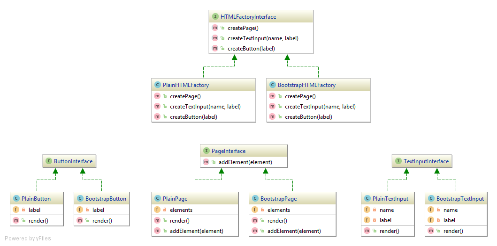

Abstract factory (Kit)
======================

The abstract factory pattern is about to delegate the creation of objects to a special object called `Factory`.
A client code that asks the factory to create objects on his behalf is coupled only with a generic interface that 
a concrete factory implements. Therefore various concrete factories are interchangeable.

Moreover the concrete classes of created objects are hidden from client behind their interfaces. 
So these classes are also interchangeable. 
Usually the objects created by concrete factory belong to the same family.

See [https://en.wikipedia.org/wiki/Abstract_factory_pattern](https://en.wikipedia.org/wiki/Abstract_factory_pattern) for more information.

## Implementation

Imagine that some html renderer needs to create a set of these objects : 
- [ButtonInterface] that is either [PlainButton] or [BootstrapButton],
- [TextInputInterface] that is either [PlainTextInput] or [BootstrapTextInput],
- [PageInterface] that is either [PlainPage] or [BootstrapPage]. 

The client code asks any object that implements [HTMLFactoryInterface] to create the objects of [ButtonInterface],
[TextInputInterface] or [PageInterface]. In place of abstract factory [HTMLFactoryInterface] could be:
- [PlainHTMLFactory] that creates [PlainButton], [PlainTextInput] and [PlainPage]
- [BootstrapHTMLFactory] that creates [BootstrapButton], [BootstrapTextInput] and [BootstrapPage]

The point is that the client code is not aware of the concrete class of the factory. Neither it is aware of concrete 
classes of objects it asks the factory to create.

[ButtonInterface]: ButtonInterface.php
[PlainButton]: Plain/PlainButton.php
[BootstrapButton]: Bootstrap/BootstrapButton.php

[TextInputInterface]: TextInputInterface.php
[PlainTextInput]: Plain/PlainTextInput.php
[BootstrapTextInput]: Bootstrap/BootstrapTextInput.php

[PageInterface]: PageInterface.php
[PlainPage]: Plain/PlainPage.php
[BootstrapPage]: Bootstrap/BootstrapPage.php

[HTMLFactoryInterface]: HTMLFactoryInterface.php
[PlainHTMLFactory]: Plain/PlainHTMLFactory.php
[BootstrapHTMLFactory]: Bootstrap/BootstrapHTMLFactory.php
