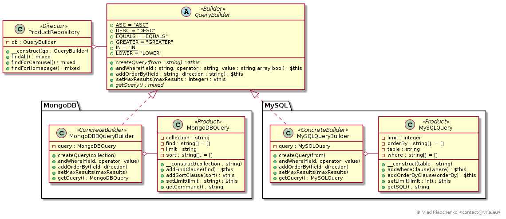

Builder
=======

The Builder pattern separates the algorithm of creating a complex object from its representation.
In other terms the algorithm that directs the creation and configuration of a complex object 
does not depend on its actual class. Neither does it depend on the actual classes of objects that is a part of this complex object.

This is achieved by hiding the complex object being build (`Product`) behind an abstract `Builder` class.
`Builder` creates, configures and builds a `Product` object step by step according to the commands it receives from `Director`.

`Director` depends on the abstract builder only. It does not depend on the `Product` 
class as well as on other classes needed to configure a product instance:

```
class Director 
{
    // The algorighm for creating a complex product object.
    // Returns either a builder with configured product in it or directly a configured product.
    public function getConfiguredProduct() 
    [
        // retrieve concrete builder in some way
        return $builder
            ->createProduct()   // Start building product
            ->addPartA($argsA1) // Add part A
            ->addPartA($argsA2) // Add another part A
            ->addPartB($argsB)  // Add part B
            ->setPartC($argsC)  // Set part C
            
            // Optionally return created and configured product. 
            // `getProduct()` method can be called from client that called `getConfiguredProduct`
            ->getProduct();
    }
}
```

`Builder` declares a common interface for all product builders:

```
abstract class Builder 
{
    abstract public function createProduct();
    public function addPartA($argsA1) { return $this; };
    public function addPartB($argsB) { return $this; };
    public function setPartC($argsC) { return $this; };
    public function getProduct() { return $this; };
}
```

A concrete implementation of `Builder` creates and configures new instances of `ProductA` class:
```
class ConcreteBuilderA extends Builder 
{
    /**
     * The product under construction
     *
     * @var ProductA
     */
    private $product;
    
    public function createProduct() 
    {
        $this->product = new Product;
        
        // Allow for a fluent interface
        return $this;
    }
    
    public function addPartA($argsA1)
    {
        // Here goes any algorithm of adding a `partA` to the `$this->product` instance.
        // Note that if a `partA` is an instance of some class, then this class remains decoupled from director
        // just like ProductA class
        
        return $this;
    };
}
```

The Builder pattern lets you vary concrete builders and concrete products independently of `Director`, in other words
the construction of a complex object is separated from its representation. The code gets a way more modular. 

The builder pattern improves readability and helps to avoid "Telescoping constructor anti-pattern":

```
// Telescoping constructor anti-pattern provokes a WTF effect bacause :
// - it is not clear what these parameters stand for,
// - `Connection::__construct` is very cumbersome because it treats all these parameters at once.
$connection = new Connection('acme.com', '/api', true, true, false, true, null, false, new Client, ['silent_errors' => true]);
```

With the Builder pattern the significance of each parameter is clear:
```
$connection = $connectionBuilder->buildConnection()
                  ->setHost('acme.com')
                  ->setBasePath('/api')
                  // ->setSecure(true)            no need because `true` is default value
                  // ->setPreFlight(true)         no need because `true` is default value
                  // ->setTrace(false)            no need because `false` is default value
                  // ->setIncludeClientInfo(true) no need because `null` is default value
                  // ->setBuffer(null)            no need because `null` is default value
                  // ->setBlocking(false)         no need because `false` is default value
                  ->setClient(new Client)
                  ->setOptions(['silent_errors' => true])
                  ->getConnection();
``` 

See [https://en.wikipedia.org/wiki/Builder_pattern](https://en.wikipedia.org/wiki/Builder_pattern) for more information.

## Implementation



This implementation of the Builder pattern is familiar to those who have ever worked with Doctrine.
Doctrine is a set of libraries focused on database storage and php objects mapping.

Consider a `product` table in database that stores various product data: `name`, `price`, `rating`, `created_at`, etc.
Different parts of application require complex queries to database in order to retrieve needed products:
- for carousel it needs 3 products maximum that are marked for a carousel and cost at least 50 
ordered by descending creation date,
- for homepage it needs 50 products maximum that are either in stock or in pre-order state and cost greater then 100.99
ordered by descending update date,
- etc.

We will concentrate all methods of querying for `product` data in [ProductRepository] class. 
This is a "repository" dedicated to retrieving data from `product` table only. It contains high level methods of such retrieval:
[findAll], [findForCarousel], [findForHomepage]. The implementation of these methods must be independent of the used database:
MySQL, MongoDB. 

[ProductRepository] does not create queries itself. 
Instead it only directs its composition to a [QueryBuilder], that is [ProductRepository] is a `Director`.

[QueryBuilder] is an abstract builder that provides a common interface for building queries to database.
There are two implementations of it:
- [MySQLQueryBuilder] that crates and configures [MySQLQuery],
- [MongoDBBQueryBuilder] that crates and configures [MongoDBQuery].

Note that [MySQLQuery] and [MongoDBQuery] do not inherit from common ancestor because it is usually not necessary.
The `MySQLQuery::getSQL()` and `MongoDBQuery::getCommand()` return real SQL query or MongoDB command that client code can execute.

[ProductRepository]: ProductRepository.php
[findAll]: ProductRepository.php#L38
[findForCarousel]: ProductRepository.php#L54
[findForHomepage]: ProductRepository.php#L73

[QueryBuilder]: QueryBuilder.php

[MySQLQueryBuilder]: MySQL/MySQLQueryBuilder.php
[MySQLQuery]: MySQL/MySQLQuery.php

[MongoDBBQueryBuilder]: MongoDB/MongoDBBQueryBuilder.php
[MongoDBQuery]: MongoDB/MongoDBQuery.php
