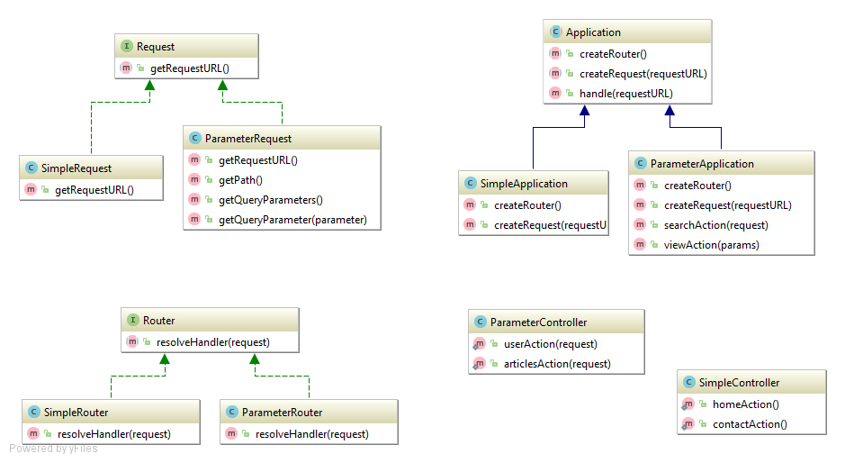

# Factory Method

Imagine a **Creator object** that creates a **Product object** for latter use.
According to [Open/closed principle](https://en.wikipedia.org/wiki/Open/closed_principle) 
it is usually important to facilitate subclassing (or other extension method) 
of **Creator class** as well as **Product class**.
This pattern suggests encapsulate the creation of **Product object** in a *Factory method*. 
Thus **Creator::getProduct** returns **Product object** and any **SubCreator::getProduct** 
returns appropriate **SubProduct**.

See [https://en.wikipedia.org/wiki/Factory_method_pattern] for more information.

## Notes

1. Use this pattern when **Creator** should not or cannot be aware of concrete of concrete 
**Product** class.
2. Factory Method creates a point of extension that permits to easily introducing a new class to a system.
3. The pattern facilitates creating of abstract layer of model. This in turn enables to interchange
different implementations (e.g. an application that uses different database types or drivers).
4. When appropriate **Creator** can provide a default implementation of Facroty Method to return
default **Product class**. Otherwise the **Creator** class must be subclassed.
5. Take care not to call abstract Factory Method in **Creator** constructor:

```php
abstract class AbstractCreator 
{
    public function __construct() 
    {
        $product = createProduct();
    }
    
    public abstract function createProduct();
}

class Creator extends AbstractCreator
{
    public function __construct() 
    {
        parent::__construct();
    }
    
    public function createProduct()
    {
        return "Created";
    }
}

$c = new Creator;
```

Predictibly, an error is thrown:
```
Fatal error:  Uncaught Error: Call to undefined function createProduct() in [...][...]:5
```

## Implementation

To show the pattern in action I created a draft of web framework that parses an URL string
and invokes a corresponding controller.



In the base level There are three abstractions:
- **[Request]** - parses URL string, stores the current URL,
- **[Router]** - matches a controller against current URL,
- **[Application]** - controls the request-response flow. This class delegates URL parsing 
to and controller resolving to **Request** and **Router** classes respectively.

**Application** has two abstract methods *createRouter*, *createRequest* to create 
*Request* and *Router*. These methods are in fact *Factory methods* that must be defined in
subclass of **Application**. 

The *handle* method of **Application** class makes use of *createRouter*, *createRequest* 
and can work with any subclass of *Request* and *Router*. In fact this method is a typical
[Template method].

Two variants of **Application** are implemented:
1. SimpleApplication:
    - [SimpleApplication](SimpleApplication/SimpleApplication.php)
    - [SimpleRouter](SimpleApplication/SimpleRouter.php)
    - [SimpleRequest](SimpleApplication/SimpleRequest.php)

2. ParameterApplication:
    - [ParameterApplication](ParameterApplication/ParameterApplication.php)
    - [ParameterRouter](ParameterApplication/ParameterRouter.php)
    - [ParameterRequest](ParameterApplication/ParameterRequest.php)

[https://en.wikipedia.org/wiki/Factory_method_pattern]: (https://en.wikipedia.org/wiki/Factory_method_pattern)
[Application]: (Application.php)
[Router]: (Router.php)
[Request]: (Request.php)
[Template method]: (/vria/design-patterns/tree/master/Behavioral/TemplateMethod)
