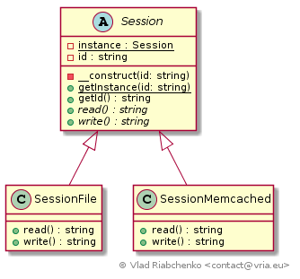

Singleton
=========

Nowadays Singleton pattern is an outcast. Nevertheless, there were so many discussions 
about this pattern that made it the most known one. Developers blame it for being 
"impossible to test", "violating single responsibility" or "just ugly". 
But the incontestable fact is that Singleton pattern elegantly solves its problem: 
ensures a class only has one instance and provides a global point of access to it. 
It is a judicious replacement for global variables with singularity restriction 
and lazy instantiating. It may surprise you but decoupling, inheritance and polymorphism, 
testing are still easily available with Singleton.

Certainly, the architecture of your application will be more solid if you use another technique to create objects because firstly there is usually no need to access the singleton globally and secondly factories can ensure singularity and/or lazy instantiating.

See [https://en.wikipedia.org/wiki/Singleton_pattern](https://en.wikipedia.org/wiki/Singleton_pattern) 
for more information.

## Implementation

Consider an application that needs to store session information.
There will be several session handlers to store data in files or database or whatever.
In resume:

- session instance must be available from any place (global scope),
- there will be multiple implementations of session storage,
- clients must be decoupled from concrete session implementations,
- there will only one single instance of the session that will be instantiated lazily

So we define abstract [Session] with the following properties:

- [Session] has private constructor that makes impossible to create session objects directly.
The constructor is also declared final to prevent subclasses from adding public constructor.
- [Session] is responsible of providing the session instance. 
Static `instance` property tracks the only session object. 
`getInstance` method returns the `instance` and instantiates it on the first call.
Note that `getInstance` checks environment variable `singleton_session_class` to know
the concrete class of `Session` subclasses to instantiate.
- [Session] defines `getId` method and few abstract methods `read` and `write`.

All clients are coupled only with [Session] and call its `getInstance` method to 
retrieve the concrete session object that can be:

- [SessionFile] that stores data in file,
- [SessionMemcached] that stores data in Memcached,
- ...

Check out [StubExampleTest] to see how singleton class can be stubbed to ease 
unit tests.

[Session]: Session.php
[SessionFile]: SessionFile.php
[SessionMemcached]: SessionMemcached.php
[StubExampleTest]: Test/StubExampleTest.php
