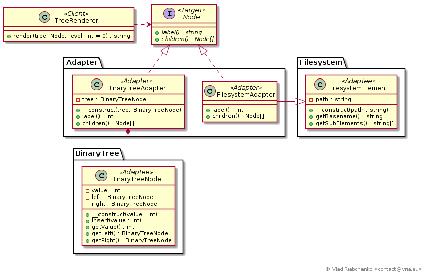

Adapter (Wrapper)
=================

Adapter pattern allows classes with incompatible interfaces to work together.
Sometimes a client class requires another class to implement particular 
interface that is not possible. In this case an adapter class is introduced
to convert the interface of adaptee to make it conform to the client class.

The participants of this pattern are:
* `Target` defines the interface that client depends on,
* `Client` uses the object of `Target` interface,
* `Adaptee` provides functionality to fulfil `Target` interface but do not
implement it.
* `Adapter` adapts the `Adaptee` to the `Target` interface.

There is a two-side view:
* We design the `Client` to work with particular `Target` interface in order to 
make the `Client` more reusable. If there are multiple libraries that can fulfil 
`Target's` functionality we can use adapters to assure they can plug into our 
system.
* We design a component that can provide the functionality for some system and
we can use adapter to plug our component into this system. In this case our
component remains not dependent on that system.

See [https://en.wikipedia.org/wiki/Adapter_pattern](https://en.wikipedia.org/wiki/Adapter_pattern) for more information.

## Implementation



In this example there is a [TreeRenderer] class that helps to visualise 
tree structures:

```
root
--uno 
----one
----two
--duo
----one
--------un
--------deux
--trio
```

We want [TreeRenderer] to visualise tree structures of different flavours: 
threes of objects, trees of files and directories, etc. So [TreeRenderer] 
visualise any object of [Node] interface. But we can not require any tree
structure of any library to implement our [Node] interface. In fact different
tree structures have their own interfaces and should not depend of our tree
renderer library:
* [BinaryTreeNode] represents a node of [binary tree] containing integer value.
Its interface consist of `getValue`, `getLeft` and `getRight` methods.
* [FilesystemElement] represents tree structure of files and directories on
hard drive. Its interface consist of `getBasename` and `getSubElements` methods.

To allow [TreeRenderer] to visualise [BinaryTreeNode] and [FilesystemElement]
we introduce adapters:
* [BinaryTreeAdapter] implements [Node] interface and holds a reference to an
object of [BinaryTreeNode]. The [TreeRenderer] makes requests to [BinaryTreeAdapter]
and the latter invokes appropriate methods of [BinaryTreeNode]. We say 
[BinaryTreeAdapter] is an object adapter.
* [FileSystemAdapter] implements [Node] interface and extends [FilesystemElement].
[FileSystemAdapter] invokes the methods of its parent [FilesystemElement].
We say [FileSystemAdapter] is an class adapter.

Here are facts that emphasize the difference and likeness of *object abapter* 
and *class adapter* :
* *Object adapter* needs two objects to function [BinaryTreeAdapter] and 
[BinaryTreeNode]. It leaves the `Adaptee` completely unaware of the fact 
of adapting.
* *Class adapter* permits for the only one object to be created [FileSystemAdapter]. 
* *Object adapter* can adapt any subclass of `Adaptee`. That is 
[BinaryTreeAdapter] will function with any subclass if [BinaryTreeNode] 
(e.g. `AutoBalancedBinaryTreeNode`).
* Since [FileSystemAdapter] extends [FilesystemElement] it is not able to adapt
any subclass of [FilesystemElement]. If there is a `LinuxFilesystemElement` class
extending [FilesystemElement] we will need to introduce a `LinuxFilesystemAdapter`
for it. Such proliferation of adapters is justified in the situation when
[FileSystemAdapter] cannot properly adapt both [FilesystemElement] and 
`LinuxFilesystemAdapter`. Note that `LinuxFilesystemAdapter` cannot extend 
[FileSystemAdapter] to factor out possible duplicate code since it already extends
`LinuxFilesystemElement`. You can always use traits.
* *Class adapter* can completely override any non-private method of `Adaptee`.
For example [BinaryTreeAdapter] is able to override `BinaryTreeNode::insert()`.
* *Class adapter* can implement abstract method of its `Adaptee`.
* *Object adapter* can use the interface as `Adaptee`. E.g.
[FileSystemAdapter] can easily adapt `FilesystemElementInterface`.


[TreeRenderer]: TreeRenderer.php
[Node]: Node.php
[BinaryTreeNode]: BinaryTree/BinaryTreeNode.php
[FilesystemElement]: Filesystem/FilesystemElement.php
[BinaryTreeAdapter]: Adapter/BinaryTreeAdapter.php
[FileSystemAdapter]: Adapter/FilesystemAdapter.php
[binary tree]: https://en.wikipedia.org/wiki/Binary_tree
