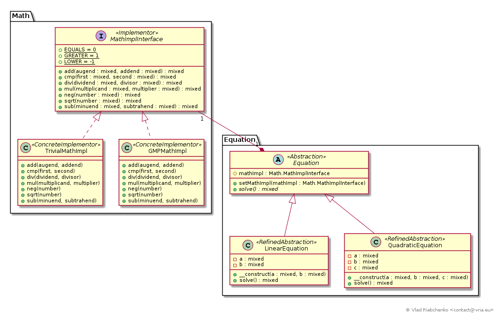

Bridge (Handle/Body)
====================

The purpose of Bridge pattern is to decouple an abstraction from its implementation so that they will not depend on each other.
The classes that relate abstraction and implementation are referred as bridge.

There is a few good reasons to break a class (or hierarchy of classes) into abstraction and implementation:

1. If the classes in hierarchy differ only in their implementation then bridge pattern helps to reduce the number of these classes:
Before :
```
abstract class Vehicle {
    abstract public function go();
}

class GasCar extends Vehicle{ ... }
class GasolineCar extends Vehicle{ ... }
class PetrolCar extends Vehicle{ ... }

class GasBus extends Vehicle{ ... }
class GasolineBus extends Vehicle{ ... }
class PetrolBus extends Vehicle{ ... }
```

Usually in this case all cars share the same public interface of a `Car`: methods like `go()`, `fillFuel()`, etc.
The buses also share the same `Bus` interface `go()`, `fillFuel()`, `takePassagers()` etc.
While the public interface of these classes are the same, their internal implementation is different. 
And that's the only reason we have `GasCar`, `GasolineCar`, `PetrolCar` in place of the one nice class `Car`.

So, let's implement bridge pattern to abstract cars and buses and move the implementation of their methods 
in separate class hierarchy.

After:

```
abstract class Vehicle {
    // @var Motorisation
    private $motorisationImpl;
    
    abstract public function go();
}

class Car extends Vehicle{ ... }
class Bus extends Vehicle{ ... }

// The interface for primitive vehicle operations. 
// Cars and buses use it to execute these operation without knowing the concrete motorisation they are using. 
interface Motorisation {
    public function startEngine() { ... ];
    public function fillTank() { ... };
}

class GasMotorisation [}
class GasolineMotorisation [}
class PetrolMotorisation [}
```

2. When the abstractions and implementations may/must vary independently. This is handy when you have no control over
implementing libraries. When they get changed in backward incompatible way the Bridge pattern helps to localize
the changes you will must to make.

3. Bridge pattern promotes extensibility. When a nuclear motorisation gets available without Bridge pattern you would create
`NuclearCar`, `NuclearBus`, `NuclearPlane`. With Bridge pattern the only thing is to add is `NuclearMotorisation` class.
Also when you have to add submarines to the application all you have to do with the Bridge pattern is to create `Submarine` 
class (and not `GasSubmarine`, `GasolineSubmarine`, `PetrolSubmarine` and so on).

See [https://en.wikipedia.org/wiki/Bridge_pattern](https://en.wikipedia.org/wiki/Bridge_pattern) for more information.

## Implementation



Imagine a variety of equations represented as classes: linear, quadratic, cubic, differential. 
The method `solve()` returning the root(s) of equation is a unique constraint for these classes. 
The hierarchy of equations classes is defined as follows:

- [Equation] (`Abstraction`) is an abstract base class for all types of equations,
- [LinearEquation] (`RefinedAbstraction`) is a linear equation `a * x + b = 0`,
- [QuadraticEquation] (`RefinedAbstraction`) is a quadratic equation `ax^2 + bx + c = 0`.

These list can be completed by any kind of equation.

While this hierarchy remains simple the things get tricky when equations must support large numbers.
In php there is a [gmp] extension that allows for arbitrary-length integers. 
So, for example, in place of `+` or `*` operators `gmp_add()` and `gmp_mul()` the must be used.

The simplest solution is to double each equation class and write its internal calculus to use gmp library.

It will be better to abstract out the equations and separate them from basic arithmetic operations. 
[MathImplInterface] (`Implementor`) contains a contract for basic arithmetic operations like adding, subtracting, negation, comparing, etc.
Equation classes are coupled to this interface and base the calculation of their roots on abstract operations:
[LinearEquation::solve()], [QuadraticEquation::solve()]. The implementors are:
- [TrivialMathImpl] is the native implementation of arithmetic operations: `+`, `-`, `*`, etc.
- [GMPMathImpl] is the gmp implementation of arithmetic operations `gmp_add()`, `gmp_mul()`, etc.

Equation classes are not aware of current concrete implementor of arithmetic functions. 
Only the Bridge which is [MathImplInterface] relies two hierarchies: 
equations which are abstractions and math implementations.

Note that for simplicity I don't treat degenerated equations like `0 * x + 3 = 0` or `0 * x ^ 2 + 5 * x + 10 = 0`.

[Equation]: Equation/Equation.php
[LinearEquation]: Equation/LinearEquation.php
[LinearEquation::solve()]: Equation/LinearEquation.php#L39
[QuadraticEquation]: Equation/QuadraticEquation.php
[QuadraticEquation::solve()]: Equation/QuadraticEquation.php#L46
[MathImplInterface]: Math/MathImplInterface.php
[TrivialMathImpl]: Math/TrivialMathImpl.php
[GMPMathImpl]: Math/GMPMathImpl.php
