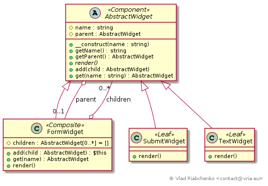
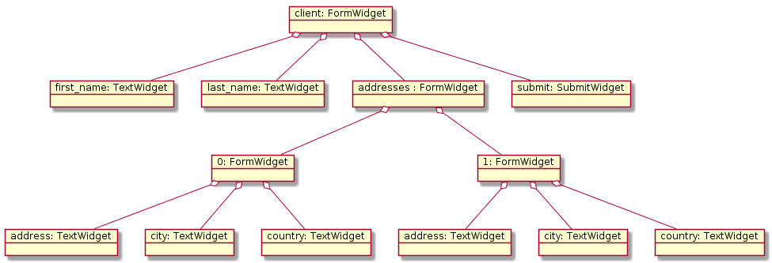

Composite
=========

This pattern lets you compose objects into tree structures. The classes of these objects inherit from one base class (or interface) 
and they are divided into two groups:

- leaves (primitives) cannot contain any children,
- composites (containers) can contain any number of child objects. Children can be both the composites and the primitives.

Composite pattern lets client code ignore the type of objects and treat primitives and compositions of objects in the same way.
This allows to simplify client code because wherever it expects a primitive object, it can accept a composite object.

The Composite pattern defines next group of classes:
- `Component` is a base class (interface) for objects in the composition. It defines the common methods for both 
leaves and composites. It also implements a default implementation of children management methods (`add`, `get`, `remove`, etc.),
- `Leaf` is a concrete primitive class that cannot have any children objects,
- `Composite` is a concrete container class that holds and manages children objects.

See [https://en.wikipedia.org/wiki/Composite_pattern](https://en.wikipedia.org/wiki/Composite_pattern) for more information.

## Implementation

This implementation is inspired by Symfony forms. There are a number of widgets corresponding to various HTML elements: 
- primitives: text widget, submit button widget, checkbox widget, etc.
- composites: form widget that can be either a main (root) form or a subform, expanded choice widget (checkboxes or radios), etc. 

This implementation defines an [AbstractWidget] (`Component`) that is a base class for all HTML widgets in composition:
- defines common variables like `name`, `parent`,
- implements default logic of children management methods,
- defines the `render` method that renders HTML code of element (and its children if available).

There are three concrete classes of HTML elements :
- [TextWidget] (`Leaf`) is a HTML text input,
- [SubmitWidget] (`Leaf`) ia a HTML submit input,
- [FormWidget] (`Composite`) is a HTML form widget. It can be either a main (root) form or a subform.
The form can contain another html widgets as children that are both the leaves (text input, submit input) and the composites (subform).

Here is an example of form that can be composed on the defined widgets:

[AbstractWidget]: AbstractWidget.php
[TextWidget]: TextWidget.php
[SubmitWidget]: SubmitWidget.php
[FormWidget]: FormWidget.php
