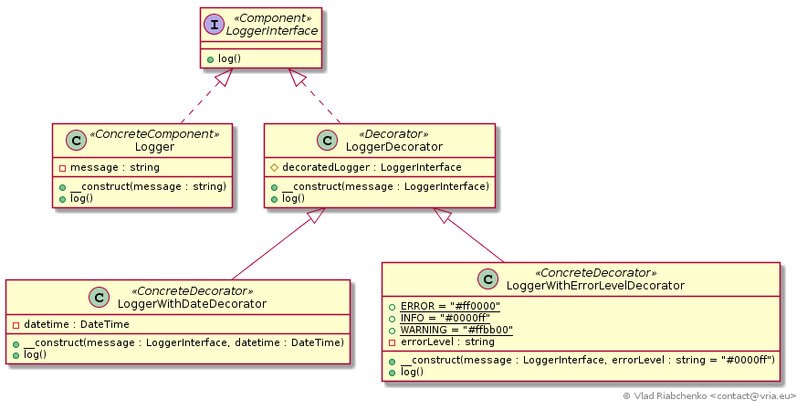
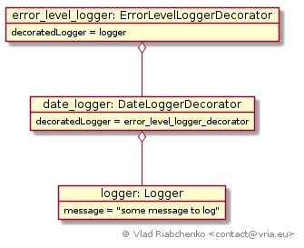

Decorator (Wrapper)
===================

Decorator pattern allows you to attach additional responsibilities to an object dynamically.
The responsibilities added to a particular object, not to its class. 
The approach consists of aggregating the extended object in another object with the same interface. 
The last is called decorator as it decorates a method of wrapped object and can execute a code before and after it forwards
a request to wrapped object. 
The essentials of the pattern is that the decorator conforms to the interface of the object it decorates.

Decorating is transparent, that is, neither the extended object itself nor other objects nor the client code 
will be affected or even aware of such decorating. The pattern allows for infinite layers of decorators.

Consider the Decorator pattern as a flexible alternative to subclassing when you need to add or alter the functionality.
Responsibilities can be added to and removed from an object at run-time.

The participants of this pattern are:

- `Component` is a contract for both the concrete components (that can be decorated) and the decorators.
This is the sole an abstract class or an interface the client code is coupled with.
- `ConcreteComponent` is a concrete implementation of component.
- `Decorator` is a common abstract class for all decorators that conforms to `Component` contract and holds wrapped component. 
- `ConcreteDecorator` is a concrete decorator. It implements the methods of `Component` contract by adding the code before and/or after 
it forwards requests to the component it decorates. 

See [https://en.wikipedia.org/wiki/Decorator_pattern](https://en.wikipedia.org/wiki/Decorator_pattern) for more information.

## Implementation

Consider a logging library what provides a logger object with various features like adding a current date/time,
coloring message, correction of spelling, etc. These features can be applied in arbitrary manner: 

- logger that colors message and adds current date/time,
- logger that colors message and checks spelling,
- bare message logger without any additional features.

[LoggerInterface] is a base interface of all loggers in application. The clients that want to log something will depend only on this interface.

[Logger] is a simple logger that outputs the message passed to it.

An then, the first possibility is to proliferate logger subclasses to take into account each combination of features: 
`LoggerWithErrorLevel`, `LoggerWithDate`, `LoggerWithErrorLevelAndTimestampAndSpellingCheck`, etc. Obviously this is not a good solution as 
each new feature will multiply the created classes.

Another possibility is to implement all features in [Logger]. 
In this case the single responsibility principle will be sacrificed, at some point there will be a complete mess in `log()` method. 

In would be better to attach the features dynamically to the logger object by wrapping it with decorators. 
Here is the object composition to log messages with date/time and error level coloring:

Here:

- `error_level_logger_decorator` is an object of [LoggerWithErrorLevelDecorator] which is a decorator what allows for error level colored logs.
It decorates `date_logger_decorator`.
- `date_logger_decorator` is an object of [LoggerWithDateDecorator] which is a decorator what adds a current date/time to logged message.
It decorates `logger` which is a simple logger.

All decorators inherit from [LoggerDecorator] what provides a default implementation of `log` method and holds a wrapped logger.

[LoggerInterface]: LoggerInterface.php
[Logger]: Logger.php
[LoggerDecorator]: LoggerDecorator.php
[LoggerWithDateDecorator]: LoggerWithDateDecorator.php
[LoggerWithErrorLevelDecorator]: LoggerWithErrorLevelDecorator.php
