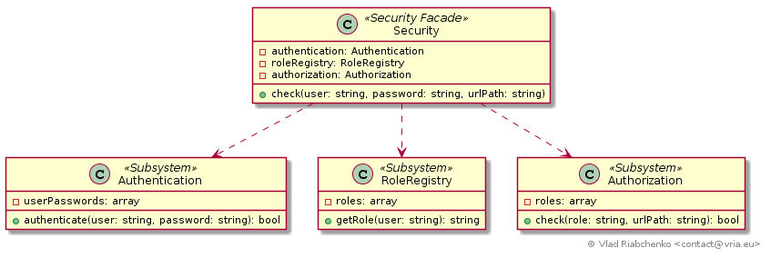

Facade
======

Facade provides clients with a simple and concise interface of complex subsystem.
This subsystem does the actual job but it contains multiple complex classes with 
possibly complex relations between them. Facade is aware of this complex subsystem
and delegates client requests to appropriate subsystem objects. The clients are 
interested to depend only on simplified Facade rather then on a complex subsystem.

Here is characteristics of Facade:
- it adds simplified interface suitable for most clients which is easier to use,
- it never hides complex subsystem classes. When client needs a better granularity
  it is able to work with complex subsystem directly,
- it does not provide additional functionality,
- it reduces the coupling between clients and subsystem,
- it can provide a level of abstraction.

See [https://en.wikipedia.org/wiki/Facade_pattern](https://en.wikipedia.org/wiki/Facade_pattern) for more information.

## Implementation

Imagine a security component of a web application that is able to authenticate
users an control access to resources by URL path. For example, user "Rick" with
a password "pa$$" and a role "ROLE_SCIENTIST" have access to URL paths starting
with "/lab" prefix.

Here is different classes implementing this functionality:

- [Authentication] verifies if a provided username is known and a provided
  password is correct,
- [RoleRegistry] returns a role for a given user,
- [Authorization] checks if a given role has access to a given URL path.

To be able to authorize a request an application must know about all that
different security classes and properly implement security protocol: check
password then retrieve roles then check authorization.

[Security] facade provides a single `check` method to implement this protocol.
The client only needs pass `user`, `password` and `url path` to authorize the
request.

[Authentication]: Authentication.php
[RoleRegistry]: RoleRegistry.php
[Authorization]: Authorization.php
[Security]: Security.php
