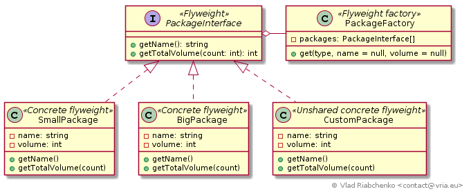

Flyweight
=========

This pattern minimizes the memory usage when an application deals with a large
number of similar objects. It extracts as much common data as possible to 
special shareable objects - flyweight. This shared data is called intrinistic 
data and can be used in different contexts thus a shared flyweight object can be 
used in different contexts. A context combined with a flyweight imitates a 
"real" distinguishable object.

So if we had an array of 100 objects sharing mostly the same state then this 
state could be represented by one flyweight object. Then the flyweight's 
methods can be passed a context data to represent each of 100 initial objects. 

See [https://en.wikipedia.org/wiki/Flyweight_pattern](https://en.wikipedia.org/wiki/Flyweight_pattern) for more information.

## Implementation

Imagine a delivery center that charges trucks with packages. Each truck can 
carry a limited weight of packages. There a two standard type packages - a small
one and a big one with defined standard volume - 2m^2 and 10^m respectively. 
Also clients can specify custom packages with arbitrary volume. All of the 
numerous trucks contain an array of packages. If each package in the application 
was represented by its own allocated object it would cost a lot of memory.

The solution is to extract common information - name of a package and its volume 
into a two shared flyweight objects: an object of [SmallPackage] and 
an object of [BigPackage]. The truck's arrays of packages reference only these 
two objects. These are concrete flyweights.

There are also custom packages that cannot be shared. Each package requires a 
separate object that represents it. It's the objects of [CustomPackage] class.
This is unshared concrete flyweight.

`SmallPackage`, `BigPackage` and `CustomPackage` implement [PackageInterface].
The latter defines a method `getTotalWeight` which returns a weight of a 
package based on intrinistic data (*volume*) and extrinistic data (*density*).
The volume value is stored in flyweight, the density value is passed to the
method.

Every instantiation of `SmallPackage`, `BigPackage` or `CustomPackage` must be
done via [PackageFactory]. It assures that the objects of `SmallPackage` and 
`BigPackage` classes are instantiated only once.

[SmallPackage]: SmallPackage.php
[BigPackage]: BigPackage.php
[CustomPackage]: CustomPackage.php
[PackageInterface]: PackageInterface.php
[PackageFactory]: PackageFactory.php
